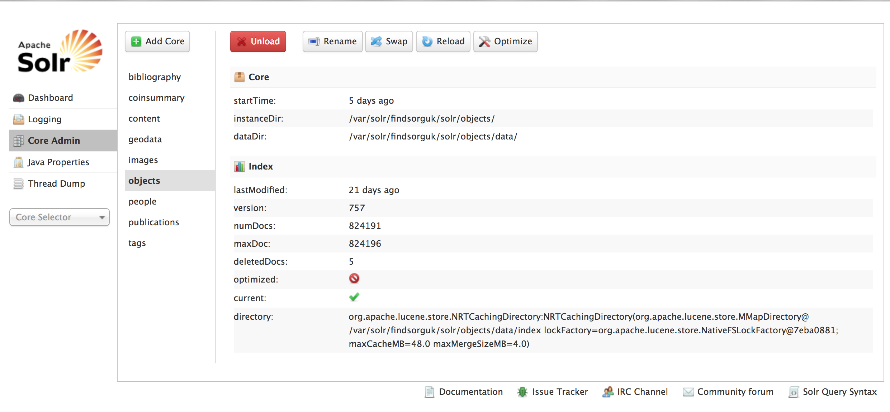

# SOLR configuration for the findsorguk system

The Portable Antiquities Scheme database uses SOLR 4.2 to run its database indexing. This repository holds SOLR 
configuration and templates for the current iteration of the system.

## Cores

The system is based around multiple cores as laid out below. Each core hold data for different content entities. The most heavily used are objects and images.

* bibliography - links to finds for publications
* coinsummary - coin summary records for hoards
* content - general site content
* geodata - Yahoo WOEID and OS open data
* images - images of objects
* objects - artefacts and hoards
* people - people table
* publications - referenced publications

## Operating environment

This SOLR configuration has been tested on OSX (El Capitan, Sierra, High Sierra), Ubuntu (12.04, 13.04, 14.04, 16.04) and Windows 7. It needs Tomcat 7 to run.

## Setting up SOLR

To install SOLR, follow this [guide](https://github.com/findsorguk/findsorguk/wiki/05.-Setting-up-solr) Make sure you have set up Tomcat 7 security as detailed in the [install guide](https://github.com/findsorguk/findsorguk/wiki/11.-Installing-on-Vanilla-MicroSoft-Azure-Ubuntu-16.04-box)

## Importing data

You can either use the SOLR GUI admin panel, or use:

    http://{hostname}:8080/solr/{corename}/dataimport?command=full-import&clean={true|false}&commit={true|false}

Of course remove the angle brackets from your value.

## Replication 

You can set up replication by following instruction in this [wiki page](https://github.com/findsorguk/findsorguk/wiki/12.-Setting-up-replication-of-Solr-cores) 
In production, the **Master** replicates within 1 second to **three slaves** ideally. Data is several GB in total, so make sure you have enough disk space.

# License

This set up is licensed under GPL V3 and is copyright the Trustees of the British Museum.

